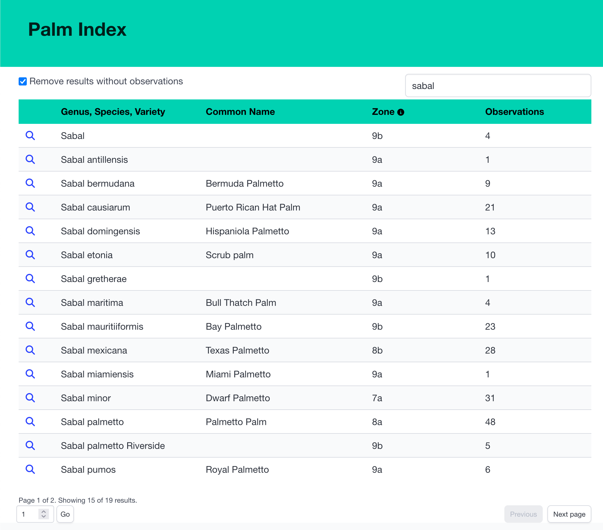
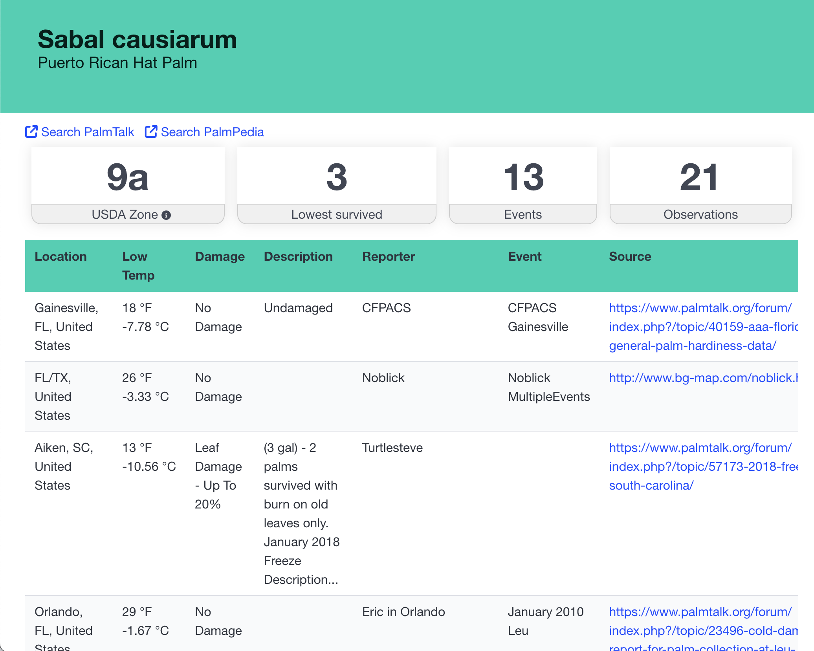
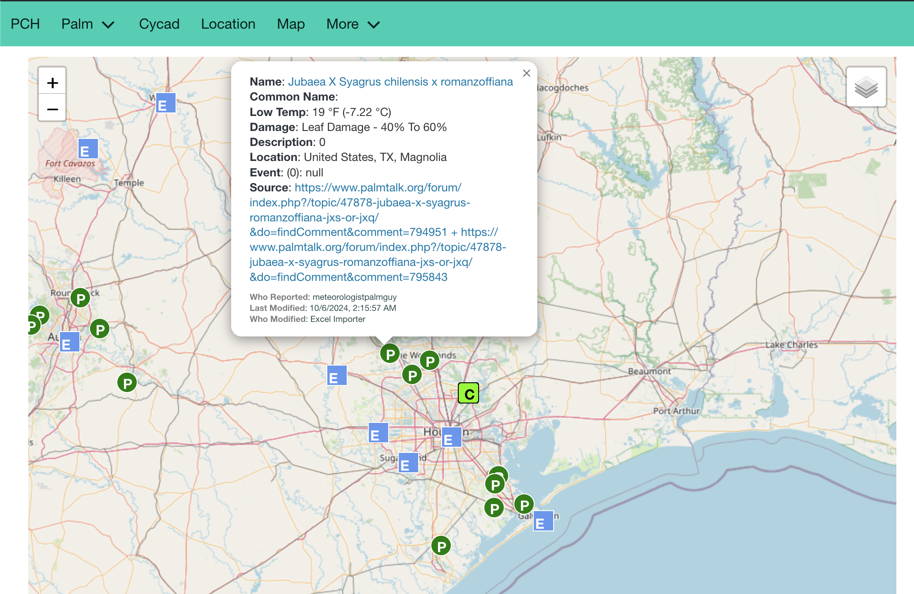

# Palm Hardiness

Palm enthusiasts the world over are sharing their observations online in forums. The information is out there but it's scattered across various forum threads and sites. A large effort has been made to collect and organize this data, and the goal of this app is to provide an easy way to browse it.

> Thanks to all the contributors and especially to [kinzyjr](https://www.palmtalk.org/forum/profile/5832-kinzyjr/ ) who aggregated all the data this app is built to display.
> kinzyjr provides it as an annual Excel document in the [cold hardiness master data](https://www.palmtalk.org/forum/topic/61358-0000-cold-hardiness-observation-master-data/ ) thread on [PalmTalk](https://www.palmtalk.org)

For now, the app is hosted at https://palmcoldhardiness.azurewebsites.net/

See [Screenshots](#screenshots)

## Prerequisites
  * [Python](https://www.python.org) 3 (Developed against 3.11.)
    * Ability to install python modules through `pip`

# Quick Start

Run the following 5 commands. [Read the full setup](setup.md#setup) instructions if you want to understand what's happening.

`python -m venv venv`

macOS & Linux: `source ./venv/bin/activate`

Windows: `venv\Scripts\Activate.ps1`

`pip install -r requirements.txt`

`python ./populate_database.py --excel ./202406092045_ColdHardinessMasterData.xlsx`

`python app.py`

Open your browser to the web address from the terminal, probably http://localhost:5000

# Libraries

Styling is the default bulma 1.0

  * https://bulma.io/documentation/

Icons are provided by Font Awesome 6 (free)

  * https://fontawesome.com/download

Geocoding is provided by Nominatim

  * https://operations.osmfoundation.org/policies/nominatim/

# Screenshots

