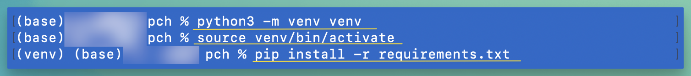
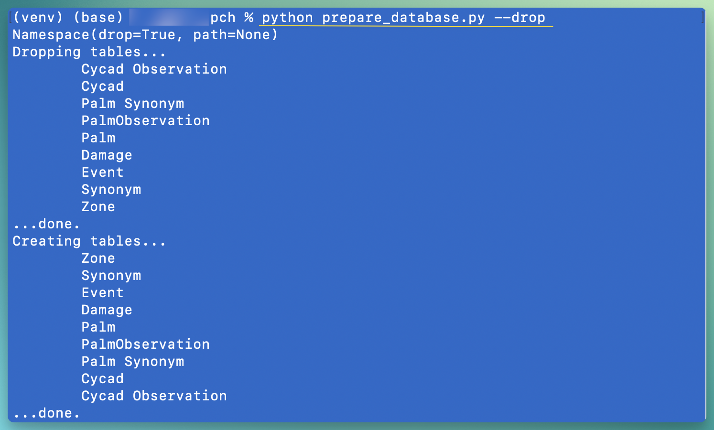
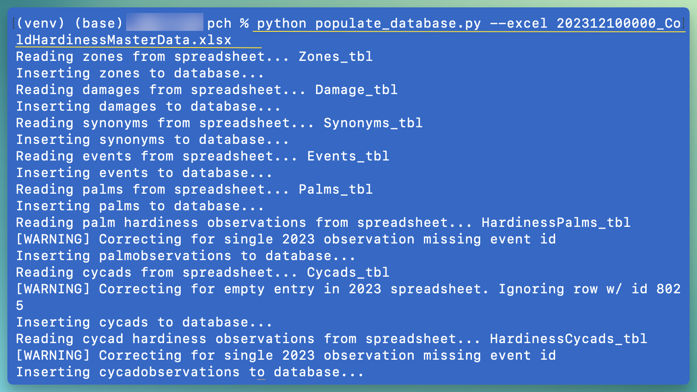
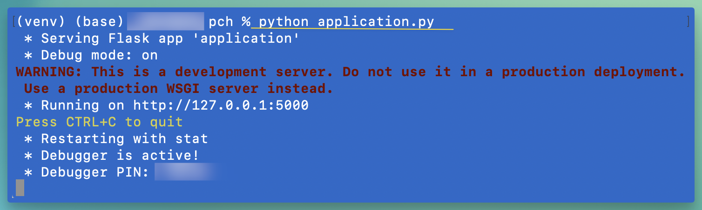

# Setup

The following commands will walk you through setting up the environment, preparing a database, and running the app.

Or return to the [README](readme.md)

## 1. Virtual Environment

Create an environment to prevent cluttering up your default install. This is only necessary once. (But it is safe to delete the directory it creates and re-run the command as often as you please.)

`python -m venv venv`

Now initialize the environment. Do this every time before running the app. 

### macOS and linux

`source ./venv/bin/activate`

### Windows

From a powershell terminal:

`venv\Scripts\Activate.ps1`

### 1a. Install the prerequisites

Packages required by the python app are listed in the text file.

`pip install -r requirements.txt`

## 2. Create the sqlite database

Build the sqlite3 database tables and relationships.

`python prepare_database.py`

## 3. Perform the import

Populate the database from the excel file. The `--excel` argument specifies the path to the cold hardiness data set.

`python ./populate_database.py --excel ./202406092045_ColdHardinessMasterData.xlsx`

### Location

The excel import populates the Location table with any new places which don't already exist in the location table. Next we need to run a *geocode* process to gather a lat/lon coord for those places. **Populating the location table with coords is a slow process.** We're using the free Nominatim geocoding service and we don't want to spam them. For that reason, each geocode request is followed by 90 seconds of sleep time before the next request is made. (You can run the app without this, but the map won't show any results.)

> If you used the included database, you already have most/all locations geocoded.

`python ./populate_database.py --location`

## 4. Launch the web app

This launches a development Flask server, probably running at http://localhost:5000 (check your terminal.) Access the app by opening a web browser to the URL.

> Safari users: You might need to replace `localhost` with `127.0.0.1`. Ex: http://127.0.0.1:5000

`python application.py`

# Drop the database for reimport 

The prepare script has a `--drop` argument which will first delete any existing database tables before creating them. 

`python prepare_database.py --drop`

## Drop Location 

There is a special table named `Location` which is not dropped with the `--drop` argument. It's better to keep this table populated. [Read more about Location](#location) If for some reason you need to destroy the contents of this table, see the arguments of `prepare_database.py`.

----

Return to the [README](readme.md)